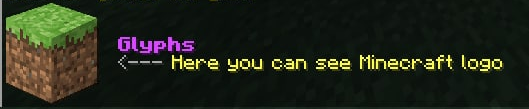
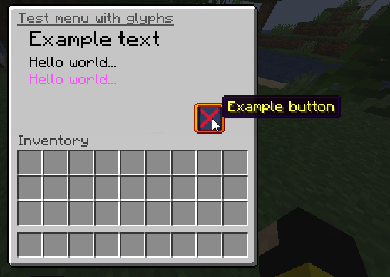

# glyphs
[](LICENSE.md)
[](https://github.com/Brikster/glyphs/archive/master.zip)

Library for convenient management of bitmap textures from Minecraft resourcepacks.
Vanilla provides you ability to create bitmap fonts with images of bigger sizes (up to 256x256),
but they work as a text - you can't render texture at the necessary place.

**glyphs** give the opportunity to make decorated chat messages, menus etc. with absolutely
positioned textures. It based on [@unnamed's "creative"](https://github.com/unnamed/creative) & [@Kyori's "adventure"](https://github.com/KyoriPowered/adventure) libraries,
so **glyphs** is platform-independent.

## Examples

### Decorated chat message


At the left part of message you can see the texture with Minecraft® logo 
(all rights belong to their respective owners, that's just an example).

#### How to reproduce

```java
var spaces = MojangSpacesGlyph.create();
var exampleLogo = ImageGlyph.of(Texture.of(
            Key.key(Glyph.DEFAULT_NAMESPACE, "chat/example_logo"),
            GlyphResources.resourceFromJar("example_logo.png")),
        new TextureProperties(/* height */ 50, /* ascent */ 56));

Collection<FileResource> resources = GlyphCompiler.instance()
        .compile(spaces, exampleLogo);

// Method that generates archive with "creative" library
createResourcepack(resources);

// Indent component with 14 spaces
Component logoIndentComponent = Component.text(" ".repeat(14));

// GlyphComponentBuilder#build returns "Component"'s instance from "adventure" library
Component resultComponent = GlyphComponentBuilder.universal(spaces)
        .append(exampleLogo)
        .build()
        .append(Component.newline().append(logoIndentComponent))
        .append(Component.newline()
            .append(logoIndentComponent)
            .append(Component.text("Glyphs", TextColor.fromHexString("#d84aff"), 
                TextDecoration.BOLD)))
        .append(Component.newline()
            .append(logoIndentComponent)
            .append(Component.text("<--- ", NamedTextColor.GRAY))
            .append(Component.text("Here you can see Minecraft® logo", NamedTextColor.YELLOW)))
        .append(Component.newline().append(logoIndentComponent))
        .append(Component.newline().append(logoIndentComponent));

// and so on to send it to a player
```

### Menu with glyphs


That's the simple menu with rendered texts of various sizes and the custom button.

#### How to reproduce
```java
// Glyphs objects
var spaces = MojangSpacesGlyph.create();

var guiBackground = ImageGlyph.of(Texture.of(
            Key.key(Glyph.DEFAULT_NAMESPACE, "gui/gui_background"),
            GlyphResources.resourceFromJar("gui_background.png")),
        new TextureProperties(/* height */ 256, /* ascent */ 19));

var exampleButton = ImageGlyph.of(Texture.of(
            Key.key(Glyph.DEFAULT_NAMESPACE, "gui/example_button"),
            GlyphResources.resourceFromJar("example_button.png")),
        new TextureProperties(/* height */ 22, /* ascent */ -56));

var font = GlyphResources.minecraftFontGlyphCollection(
        List.of(new TextureProperties(/* height */ 12, /* ascent */ -6),
            new TextureProperties(/* height */ 8, /* ascent */ -24),
            new TextureProperties(/* height */ 8, /* ascent */ -36)));

Collection<FileResource> resources = GlyphCompiler.instance()
        .compile(spaces, guiBackground, exampleButton, font);
resources.addAll(GlyphResources.blankSlotResources());

// Method that generates archive with "creative" library
createResourcepack(resources);

// Building component for inventory title
Component titleComponent = GlyphComponentBuilder.gui(spaces)
        .append(guiBackground)
        .append(/* position */ 131, exampleButton)
        .append(/* position */ 16, font.translate(/* height */ 12, /* ascent */ -6, "Example text"))
        .append(/* position */ 16, font.translate(/* height */ 8, /* ascent */ -24, "Hello "))
        .append(PositionType.RELATIVE, font.translate(/* height */ 8, /* ascent */ -24, "world..."))
        .append(PositionType.ABSOLUTE, /* position */ 16, font.translate(/* height */ 8, /* ascent */ -36, "Hello world...", NamedTextColor.LIGHT_PURPLE))
        .build()
        .append(Component.text("Test menu with glyphs", NamedTextColor.DARK_GRAY, TextDecoration.UNDERLINED));

// and so on to open chest GUI
```

See [full code](https://github.com/Brikster/glyphs/blob/master/example-bukkit/src/main/java/ru/brikster/glyphs/bukkit/ExamplePlugin.java) of Bukkit plugin with both examples.

## Usage
You need an implementation of Minecraft server with [adventure](https://github.com/KyoriPowered/adventure) library support.
Also, that's required Minecraft 1.19 and higher to support all the library features.

### Build
Use Gradle to build library and publish it to Maven repository.
For example, you can publish it to Maven local repository:
```shell
gradle build publishToMavenLocal
```

### Add dependency

#### Gradle
```groovy
repositories {
    mavenLocal()
}

dependencies {
    // Main dependency with GlyphComponentBuilder and GlyphCompiler
    implementation "ru.brikster:glyphs-api:$version"
    // Optional dependency with some frequently used resources (Minecraft font etc.)
    implementation "ru.brikster:glyphs-resources:$version"
}
```


